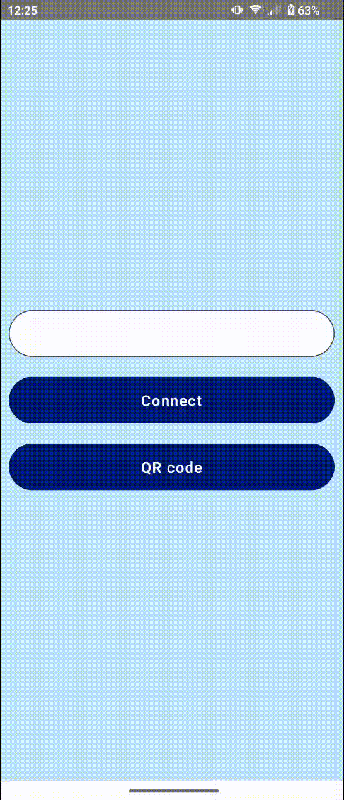
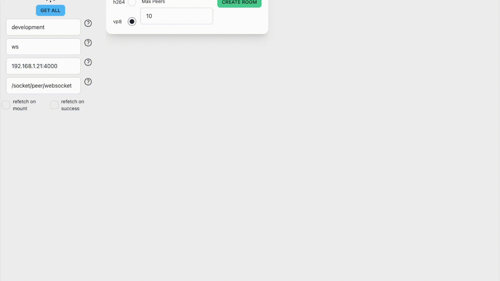
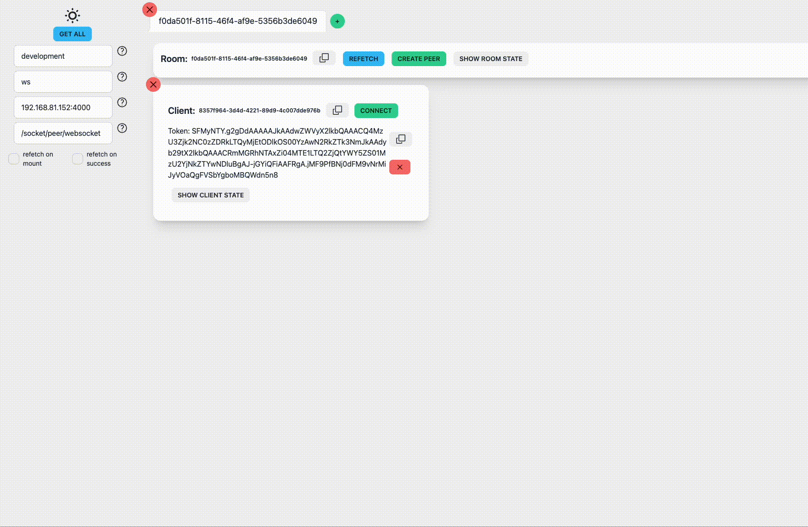

import JellyfishArchitecture from "./_jellyfish-architecture.mdx";
import StartingJellyfishBackend from "./_starting-jellyfish-backend.mdx";
import StartingJellyfishDashboard from "./_starting-dashboard.mdx";

# Android Minimal Working Example

## What you'll learn

This tutorial will guide you through creating your first Android project which
uses Jellyfish client. By the end of the tutorial, you'll have a working
application that connects to the front-end dashboard using WebRTC technology and
streams and receives camera tracks.



You can check out the finished project [here](https://github.com/jellyfish-dev/jellyfish-clients-tutorials/tree/main/JellyfishDashboardAndroid).

## What do you need

- a little bit of experience in creating Android apps and Jetpack Compose
- Android Studio IDE, Android device for testing

## Jellyfish architecture

<JellyfishArchitecture />

## Setup

### Add dependencies

Firstly add Jitpack repository in your app's `settings.gradle` file:

```gradle
dependencyResolutionManagement {
    repositories {
        google()
        mavenCentral()
        // highlight-next-line
        maven { url 'https://jitpack.io' }
    }
}
```

Then add Jellyfish Client dependency:

```gradle
dependencies {
    implementation 'com.github.jellyfish-dev:android-client-sdk:<<version>>'
}
```

### AndroidManifest.xml changes

In order to connect to the backend without setting up HTTPS add this line in
`AndroidManifest.xml`:

```xml
    <application
        ...
        // highlight-next-line
        android:usesCleartextTraffic="true">
```

:::caution

Don't add this line in production apps! Using HTTPS is essential for users' security.

:::

### Start the Jellyfish backend

<StartingJellyfishBackend />

### Start the dashboard web front-end

<StartingJellyfishDashboard />

## Connecting to the server and joining the room

Our app will consist of two screens. The first one allows the user to type, paste or
scan the peer token and connect to the room. The second screen shows room
participants with their video tracks.

### App structure

To write the app we'll use Jetpack Compose. Firstly, create a new Android Studio
project with empty Activity.

Then, we'll replace the default app theme. Feel free to skip this step and style
your components however you want, we just put them there for completeness.

```kotlin title=Color.kt
package com.example.jellyfishdashboardandroid.ui.theme

val seaBlue40 = Color(0xFFBFE7F8)
val seaBlue20 = Color(0xFFF1FAFE)
val darkBlue100 = Color(0xFF001A72)
val white = Color(0xFFFFFFFF)
val darkText = Color(0xFF001A72)
```

```kotlin title=Theme.kt
package com.example.jellyfishdashboardandroid.ui.theme

private val LightColorScheme = lightColorScheme(
    primary = darkBlue100,
    background = seaBlue40,
    onPrimary = white,
)

@Composable
fun JellyfishDashboardAndroidTheme(
    content: @Composable () -> Unit
) {
    MaterialTheme(
        colorScheme = LightColorScheme,
        typography = Typography,
        content = content
    )
}
```

```kotlin title=Type.kt
package com.example.jellyfishdashboardandroid.ui.theme

val Typography = Typography(
    bodyLarge = TextStyle(
        fontFamily = FontFamily.Default,
        fontWeight = FontWeight.Normal,
        fontSize = 16.sp,
        lineHeight = 28.sp,
        letterSpacing = 0.5.sp
    ),
    labelLarge = TextStyle(
        fontFamily = FontFamily.Default,
        fontWeight = FontWeight.W600,
        fontSize = 18.sp,
        lineHeight = 24.sp,
        letterSpacing = 1.sp,
    ),
)
```

Our app will contain one activity: we'll leave it named `MainActivity` and it
should be already created by Android Studio. This activity will be paired with
one `ViewModel`, we'll name it `MainViewModel`:

```kotlin title=MainViewModel.kt
class MainViewModel(application: Application) : AndroidViewModel(application) {

}
```

```kotlin title=MainActivity.kt
class MainActivity : ComponentActivity() {
    private val viewModel: MainViewModel by viewModels()

    // ...
}
```

In `MainActivity.kt` we'll store code responsible for displaying things (UI). In
`MainViewModel.kt` we'll store a class responsible for the business logic of the
app (storing data, managing the state of the app, and connecting to the server).

Of course, your app might be a lot more complicated and use a different
structure. The two screens should be probably separated as different
activities/fragments. For this tutorial though, this simple structure should be
enough.

### Connect screen

The UI of the Connect screen consists of a simple text input and a few buttons.
The flow for this screen is simple: the user either copies the peer token from the
dashboard or scans it with a QR code scanner and presses Connect button. The QR
code scanner is completely optional, but we'll show how to add it for convenience.

Firstly, we need to store the peer token somewhere in the ViewModel:

```kotlin MainViewModel.kt
class MainViewModel(application: Application) : AndroidViewModel(application) {
    val peerToken = MutableStateFlow("")
}
```

Then we'll add code for the UI:

```kotlin MainActivity.kt
class MainActivity : ComponentActivity() {
    //...

    @Composable
    fun ConnectContent() {
        val peerToken = viewModel.peerToken.collectAsState()

        Column(
            modifier = Modifier
                .fillMaxWidth()
                .fillMaxHeight()
                .padding(10.dp),
            verticalArrangement = Arrangement.spacedBy(
                24.dp, alignment = Alignment.CenterVertically
            ),
        ) {
            OutlinedTextField(
                singleLine = true,
                modifier = Modifier
                    .fillMaxWidth()
                    .height(56.dp),
                shape = CircleShape,
                value = peerToken.value,
                onValueChange = { it: String -> viewModel.peerToken.value = it },
                colors = TextFieldDefaults.textFieldColors(
                    containerColor = Color.White
                )
            )
            Button(
                modifier = Modifier
                    .fillMaxWidth()
                    .height(56.dp),
                onClick = { connect() } // we'll add this method soon
            ) {
                Text("Connect")
            }
            Button(
                modifier = Modifier
                    .fillMaxWidth()
                    .height(56.dp),
                onClick = { scanQRCode() }) { // we'll add this method soon
                Text("QR code")
            }
        }
    }
}
```

### QR Code scanning

We know that copy-paste from desktop to mobile device is annoying. That's why to
copy the peer token from the dashboard we'll use QR code scanning. It's quite
easy to add if we use a Google library to do it: no need for creating the UI,
opening the camera, handling permissions, etc. - everything is handled by the
library :tada:

Firstly, add a dependency in your `build.gradle`:

```gradle title=build.gradle
implementation 'com.google.android.gms:play-services-code-scanner:16.1.0'
```

Then scan the code like this:

```kotlin title=MainActivity.kt
class MainActivity : ComponentActivity() {
    //...

    private fun scanQRCode() {
        val options = GmsBarcodeScannerOptions.Builder().setBarcodeFormats(
            Barcode.FORMAT_QR_CODE, Barcode.FORMAT_AZTEC
        ).enableAutoZoom().build()

        val scanner = GmsBarcodeScanning.getClient(this, options)

        scanner.startScan().addOnSuccessListener { barcode ->
            val rawValue: String? = barcode.rawValue
            if (rawValue != null) {
                viewModel.peerToken.value = rawValue
            }
        }.addOnCanceledListener {
            // Task canceled
        }.addOnFailureListener { e ->
            // Task failed with an exception
        }
    }
}
```

Make sure to handle the errors gracefully. Now if you scan the code, the peer
token should appear in the text field.



### Handling camera permissions

Before we start connecting we want to have camera permissions sorted out. On
Android, we need to ask the user for permission to use the camera before
creating the camera track.

We're lazy, so we'll use a handy Google library for that:

```gradle title=build.gradle
implementation 'com.google.accompanist:accompanist-permissions:0.28.0'
```

If we don't have camera permission yet, we'll display the "Request permissions"
button, instead of the "Connect" button. The button requests camera permissions.
If the permission is granted, we'll display the "Connect" button instead:

```kotlin title=MainActivity.kt
    // highlight-start
    @OptIn(ExperimentalPermissionsApi::class)
    @Composable
    fun ConnectButton(modifier: Modifier) {
        val cameraPermissionState = rememberPermissionState(
            android.Manifest.permission.CAMERA
        )

        if (cameraPermissionState.status.isGranted) {
            Button(onClick = { viewModel.connect() }, modifier = modifier) {
                Text("Connect")
            }
        } else {
            Button(
                onClick = { cameraPermissionState.launchPermissionRequest() }, modifier = modifier
            ) {
                Text("Request camera permissions")
            }
        }
    }
    // highlight-end

    // ...

    fun ConnectContent() {
        // ...

        Column(
            // ...
        ) {
            OutlinedTextField(
               // ...
            )
            // highlight-start
            ConnectButton(
                modifier = Modifier
                    .fillMaxWidth()
                    .height(56.dp)
            )
            // highlight-end
            Button(
                // ...
            ) {
                Text("QR code")
            }
        }
    }
```

### Connecting to the backend

Finally, we can write code to connect to the backend. It will be the
responsibility of the `MainViewModel`.

Firstly, create `JellyfishClient`:

```kotlin title=MainViewModel.kt
class MainViewModel(application: Application) : AndroidViewModel(application) {
    //...
    // highlight-next-line
    private val client = JellyfishClient(getApplication(), this)
}
```

Then write the `connect()` function:

```kotlin title=MainViewModel.kt
class MainViewModel(application: Application) : AndroidViewModel(application) {
    //...
    // highlight-start
    fun connect() {
        client.connect(
            Config(
                websocketUrl = "ws://192.168.0.1:4000/socket/peer/websocket",
                token = peerToken.value,
            ),
        )
    }
    // highlight-end
}
```

The `websocketUrl` is the URL of the Jellyfish backend, be sure to change it to
your local backend. Also, we strongly recommend storing it for example as an
environment variable.

The `token` is the peer token provided by the user. It's used to determine the
user and the room to be connected to.

Now we have to get the answer from the backend that we're connected
successfully. To do this we need to implement the `JellyfishClientListener`
interface.

Firstly we'll implement `onAuthSuccess()` and `onAuthError()` callbacks.

`onAuthSuccess()` is called when the user is authenticated successfully and can
set up tracks to stream and join the room. So we'll do so:

```kotlin title=MainViewModel.kt
class MainViewModel(application: Application) : AndroidViewModel(application),
// highlight-next-line
    JellyfishClientListener {

    // ...

// highlight-next-line
    private var localVideoTrack: LocalVideoTrack? = null

    // highlight-start
    private fun setupTracks() {
        val videoParameters = VideoParameters.presetHD169
        localVideoTrack = client.createVideoTrack(videoParameters, emptyMap())
    }

    override fun onAuthSuccess() {
        setupTracks()
        client.join()
    }

    // highlight-end
}
```

In the `setupTracks()` function we set up a local video track to stream. We use
a preset with reasonable defaults, but there are many settings you can customize
(resolution, bandwidth, simulcast, etc.). The local video track streams the
local device camera. You can also set up an audio track, but for this tutorial
we omitted it.

Then in `onAuthSuccess()` after setting up tracks we join the room. When user
joins the room, the user can receive tracks from other peers and vice-versa.

Don't forget to implement also `onAuthError()` function - it's called when the
authentication failed and you should handle it by for example informing the user
that something went wrong.

The backend informs us that the user successfully joined the room in the
`onJoined` callback. In the `onJoined` callback we also receive information
about other peers in the room and local user id. We're going to store
information about peers in `MainViewModel`:

```kotlin title=MainViewModel.kt
data class Participant(
    val id: String,
    val videoTrackContext: TrackContext? = null,
)

class MainViewModel(application: Application) : AndroidViewModel(application),
    JellyfishClientListener {
    // ...
    val participants = MutableStateFlow<List<Participant>>(emptyList())
    val isConnected = MutableStateFlow(false)

    private val mutableParticipants = HashMap<String, Participant>()

    // ...

     override fun onJoined(peerID: String, peersInRoom: List<Peer>) {
        peersInRoom.forEach {
            mutableParticipants[it.id] = Participant(
                it.id,
            )
        }
        isConnected.value = true
        emitParticipants()
    }

    private fun emitParticipants() {
        participants.value =
            mutableParticipants.values.filter { p -> p.videoTrackContext != null }.toList()
    }
}
```

`Participant` is a simple class for storing data about participants - in this
example, it's just their id and track context.

`participants` and `isConnected` are state variables that are exposed to the UI
(`MainActivity`). `participants` stores current peers and updates when peers are
added or removed. `isConnected` stores whether the app is connected to the
server or not. If it's connected we'll display a screen displaying participants.

In the `onJoined` callback we add participants that are currently in the room
and update the UI accordingly.

Remember to also implement the `onJoinError` callback, just like `onAuthError`.

With this, you should be able to connect to the server now. Scan the QR code and
connect, and in the dashboard, you should be able to see video from the camera on
your mobile device.

## Room screen

Now we need a UI to display other participants. Jellyfish Client provides a
component for that: `VideoTextureViewRenderer`. Because we're using Jetpack
Compose and this is just regular Android `View`, we're going to wrap it using
`AndroidView` Composable. Also, we'll need to avoid memory leaks by releasing the
view when necessary.

```kotlin title=MainActivity.kt

    @Composable
    fun ParticipantVideoView(participant: Participant, modifier: Modifier = Modifier) {
        var activeVideoTrack: VideoTrack? by remember { mutableStateOf(null) }
        var view: VideoTextureViewRenderer? by remember { mutableStateOf(null) }

        // set the renderer of the track when the view is initialized or updated
        fun setupTrack(videoTrack: VideoTrack, view: VideoTextureViewRenderer) {
            if (activeVideoTrack == videoTrack) return

            activeVideoTrack?.removeRenderer(view)
            videoTrack.addRenderer(view)
            activeVideoTrack = videoTrack
        }

        // remove the renderer from the track if the track has changed
        DisposableEffect(participant.videoTrackContext?.track) {
            onDispose {
                view?.let {
                    (participant.videoTrackContext?.track as VideoTrack).removeRenderer(it)
                }
            }
        }

        // release the view if the view is removed
        DisposableEffect(currentCompositeKeyHash.toString()) {
            onDispose {
                view?.release()
            }
        }

        AndroidView(
            factory = { context ->
                VideoTextureViewRenderer(context).apply {
                    // init the VideoTextureViewRenderer with participant's video track
                    this.init((participant.videoTrackContext?.track as VideoTrack).eglContext, null)
                    setupTrack((participant.videoTrackContext.track as VideoTrack), this)
                    view = this
                }
            },
            update = { updatedView ->
                setupTrack((participant.videoTrackContext?.track as VideoTrack), updatedView)
            },
            modifier = modifier,
        )
    }
```

Then we'll use the `ParticipantVideoView` to display participants in a grid (using `LazyVerticalGrid`):

```kotlin title=MainActivity.kt

    @Composable
    fun RoomScreen() {
        val participants = viewModel.participants.collectAsState()

        Column(
            modifier = Modifier
                .fillMaxWidth()
                .fillMaxHeight()
                .padding(10.dp),
            verticalArrangement = Arrangement.SpaceBetween,
            horizontalAlignment = Alignment.CenterHorizontally,
        ) {
            LazyVerticalGrid(
                columns = GridCells.Fixed(if (participants.value.count() > 2) 2 else 1),
                verticalArrangement = Arrangement.spacedBy(
                    16.dp,
                    alignment = Alignment.CenterVertically
                ),
                horizontalArrangement = Arrangement.spacedBy(
                    16.dp,
                    alignment = Alignment.CenterHorizontally
                )
            ) {
                items(participants.value.count()) {
                    ParticipantVideoView(
                        participant = participants.value[it],
                        modifier = Modifier
                            .clip(RoundedCornerShape(10.dp))
                            .aspectRatio(1.0f, matchHeightConstraintsFirst = true)
                            .fillMaxWidth()
                            .fillMaxHeight(),
                    )
                }
            }
        }
    }
```

To display the Room screen we just need to modify the `onCreate` method in
`MainActivity`. If we're connected, we display the Room screen, otherwise the
Connect screen.

```kotlin title=MainActivity.kt

    override fun onCreate(savedInstanceState: Bundle?) {
        super.onCreate(savedInstanceState)
        setContent {
            // highlight-next-line
            val isConnected = viewModel.isConnected.collectAsState()

            JellyfishDashboardAndroidTheme {
                // A surface container using the 'background' color from the theme
                Surface(
                    modifier = Modifier.fillMaxSize(), color = MaterialTheme.colorScheme.background
                ) {
                    // highlight-start
                    if (isConnected.value) {
                        RoomScreen()
                    } else {
                        ConnectContent()
                    }
                    // highlight-end
                }
            }
        }
    }
```

To test it you can add another participant and their new track (displaying for
example rotating frog) in the dashboard like this (do it before joining the room):



### Adding/removing peers and tracks

If you run the app, you'll see that nothing happens if a new participant joins the room. We have to handle this by implementing some more methods from the `JellyfishClientListener` interface:

```kotlin title=MainViewModel.kt
class MainViewModel(application: Application) : AndroidViewModel(application),
    JellyfishClientListener {

    //...

    override fun onPeerJoined(peer: Peer) {
        mutableParticipants[peer.id] = Participant(
            id = peer.id,
        )
        emitParticipants()
    }

    override fun onPeerLeft(peer: Peer) {
        mutableParticipants.remove(peer.id)
        emitParticipants()
    }

    override fun onTrackReady(ctx: TrackContext) {
        val participant = mutableParticipants[ctx.endpoint.id] ?: return

        val (id, newParticipant) = when (ctx.track) {
            is RemoteVideoTrack -> {
                val p = participant.copy(videoTrackContext = ctx)
                Pair(ctx.endpoint.id, p)
            }
            else ->
                throw IllegalArgumentException("invalid type of incoming remote track")
        }
        mutableParticipants[id] = newParticipant
        emitParticipants()
    }

    override fun onTrackRemoved(ctx: TrackContext) {
        val participant = mutableParticipants[ctx.endpoint.id] ?: return
        val videoTrackId = participant.videoTrackContext?.trackId ?: return

        val newParticipant = if (ctx.trackId == videoTrackId) {
            participant.copy(videoTrackContext = null)
        } else {
            throw IllegalArgumentException("track has not been found for given endpoint")
        }

        mutableParticipants[ctx.endpoint.id] = newParticipant
        emitParticipants()
    }
}
```

Those methods are rather self-explanatory: `onPeerJoined()` is called when
someone joins the room, `onPeerLeft()` is called when someone leaves the room.
Similarly, `onTrackReady()` is called when a track is ready to display and
`onTrackRemoved()` is called when a track is no longer streamed.

### Gracefully leaving the room

To leave a room we'll add a button for the user. When the user clicks it, we
gracefully leave the room, close the server connection, and go back to the
Connect screen.

```kotlin title=MainActivity.kt
    @Composable
    fun RoomScreen() {
        val participants = viewModel.participants.collectAsState()

        Column(
            // ...
        ) {
            LazyVerticalGrid(
               // ...
            ) {
             // ...
            }
            // highlight-start
            Button(
                onClick = {
                    viewModel.disconnect()
                },

                ) {
                Text("Disconnect")
            }
            // highlight-end
        }
    }
```

And in `MainViewModel` we'll add the `disconnect()` function:

```kotlin title=MainViewModel.kt
class MainViewModel(application: Application) : AndroidViewModel(application),
    JellyfishClientListener {

    // ...

    fun disconnect() {
        localVideoTrack?.stop()
        localVideoTrack = null
        client.cleanUp()
        isConnected.value = false
    }
}
```

## Summary

Congrats on finishing your first Jellyfish mobile application! In this tutorial,
you've learned how to make a basic Jellyfish client application that streams and
receives video tracks with WebRTC technology.

But this was just the beginning. Jellyfish Client supports much more than just
streaming camera: it can also stream audio, screencast your device's screen,
configure your camera and audio devices, detect voice activity, control
simulcast, bandwidth and encoding settings, show camera preview, display WebRTC
stats and more to come. Check out our other tutorials to learn about those
features.

You can also take a look at our fully featured [Videoroom Demo
example](https://github.com/jellyfish-dev/react-native-membrane-webrtc/tree/master/example):


It's written in React Native, but React Native SDK uses Android SDK under the hood!
